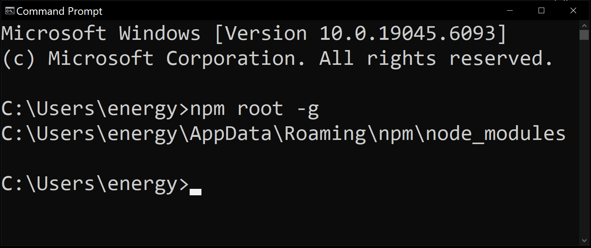
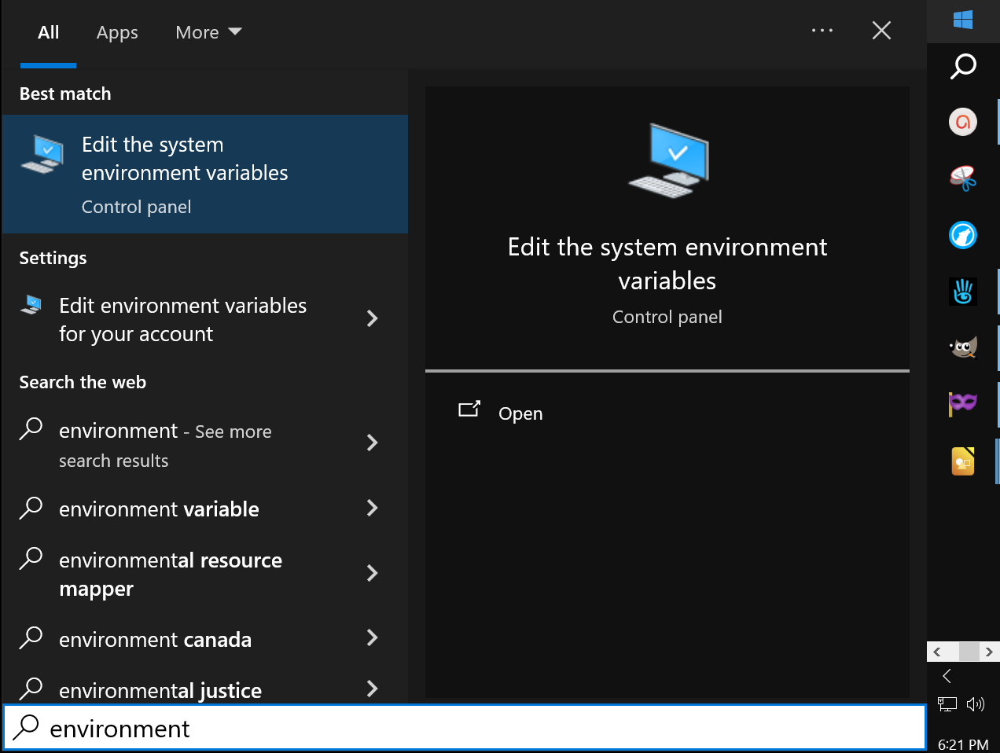
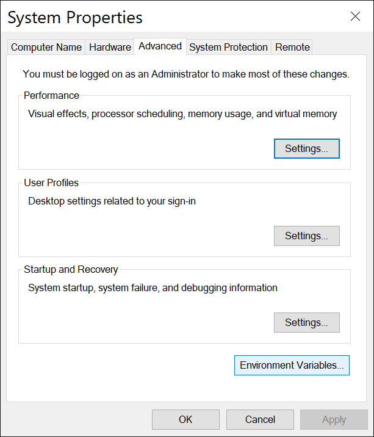
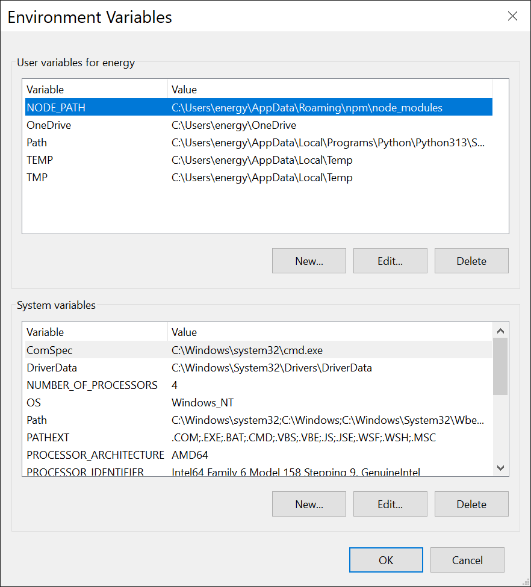

# Centralizing Node.js Worldwide Packages - a

# Summary: 
### We can make it so Node.js resolves modules worldwide, (like nodemailer, express, etc.) without having to install them into every project folder!

---

# Instructions:

# Set Environment Variable

### We set up a **User Environment Variable** to be able to use packages worldwide, or else they would have to be installed locally to each project folder.

---

# Find the node_modules world wide installation

### In Command Prompt we type:

# npm root -g
### press Enter

> #

> #

---

# Copy the Address Shown.
### **C:\Users\energy\AppData\Roaming\npm\node_modules**

---

# Environment Variables

### In **Start menu**, Search for:   Environment Variables

  

### Left Click on:
## **Environment Variables... button**

  

### In the **User Variables** Section at the top:  

### Left Click on:
## **New...**

  

### name
## NODE_PATH

### value
## C:\Users\energy\AppData\Roaming\npm\node_modules

## Confirm by Clicking **OK button**
## Make sure to Click Every **OK button** to confirm the changes

---

//----//

// Dedicated to God the Father
// All Rights Reserved Christopher Andrew Topalian Copyright 2000-2025
// https://github.com/ChristopherTopalian
// https://github.com/ChristopherAndrewTopalian
// https://sites.google.com/view/CollegeOfScripting

